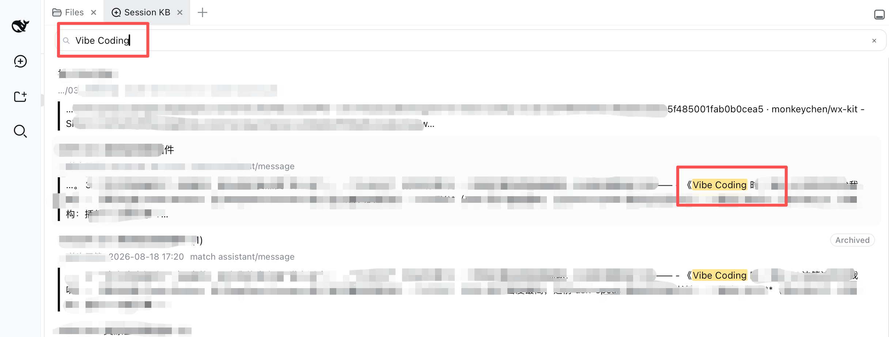
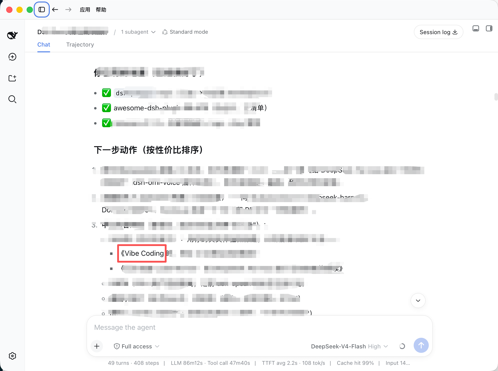
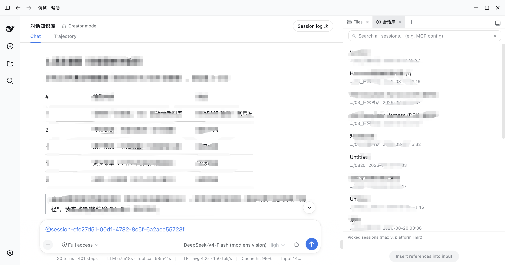
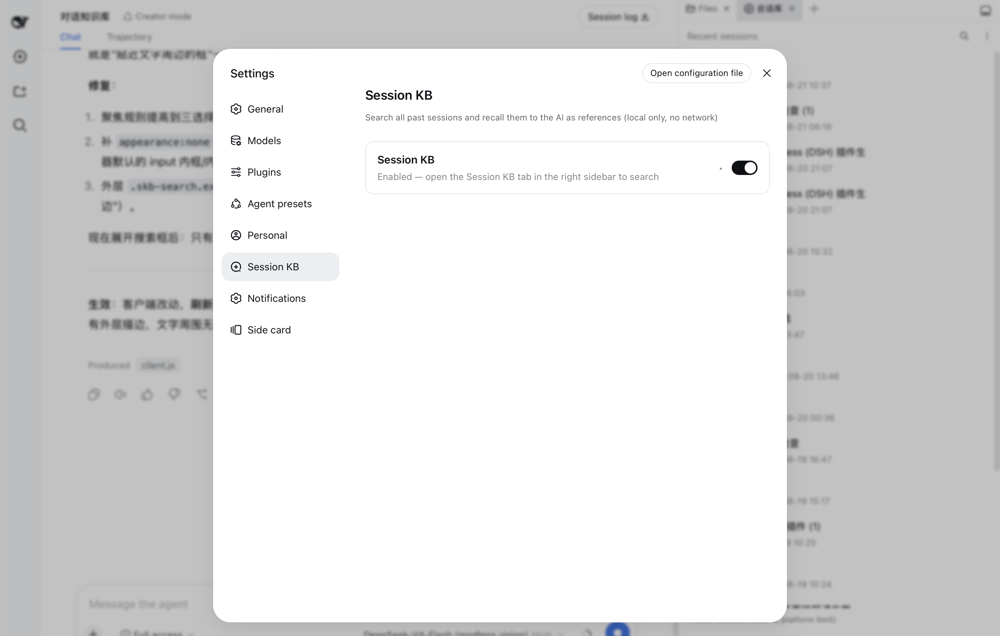
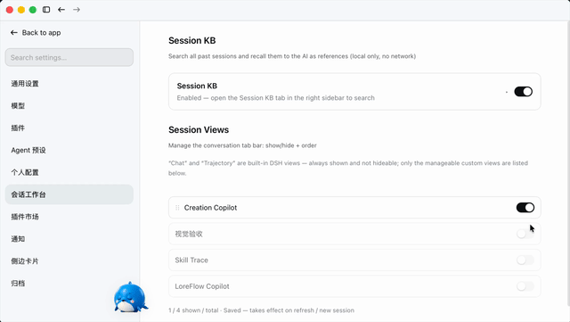
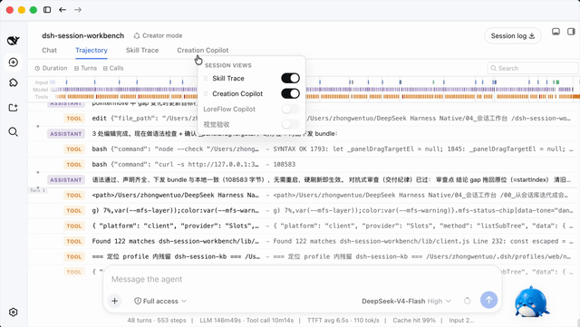

# 历史会话检索dsh插件

中文名：历史会话检索dsh插件。仓库名 dsh-session-workbench。

## 本副本（DeepSeek Harness 0.1.7-rc.1）

功能：在侧栏里全文搜索以前的会话，看到命中的那一句，可以打开并滚到原文，也可以把最多 3 个会话当成引用插进输入框。还能管理会话顶部标签的显示和顺序。搜索用的是 Harness 自带的 SQLite 全文索引，数据留在本机。

用法：

```sh
dsh plugin --profile web add "link:<克隆下来的目录>"
dsh web
```

装好后在侧栏打开「会话工作台」，在搜索框里输入词。搜索超过几秒时，页面会提示索引还在对账，那不是每次都从零重建。开关和搜索范围在插件设置里。来源和许可证见 [来源说明.md](来源说明.md)。

> Search every past session and recall the ones you need as `@references`; manage the conversation-view tab bar (show/hide + reorder). One plugin, three entry points.

[English](#english) · [中文](#中文) · [Privacy](PRIVACY.md) · [Docs](../docs/README.md)

---

## What it is

DeepSeek Harness ships with a full-text search engine (SQLite FTS5) and cross-session references (`@session mention`), but neither has a user-facing interface. This plugin adds the missing **discover → browse → insert** layer:

- **Search** — full-text search across all your past sessions (all workspaces), with workspace / time-range / archive filters, and cursor pagination;
- **Fragment hits (v1.1)** — results are per-session best-hit **fragment cards**: the matched sentence highlighted with its surrounding context (lazy-loaded), so you see *the sentence*, not just *which session*;
- **Same-session hits (v1.2)** — expanding a fragment card shows a "More hits in this session" fold with the other matches (first 5, then load more), each highlighted — no more hunting for the rest of a session's matches;
- **Locate (v1.1, composite anchors in v1.2)** — click **Locate** on a fragment card to open that session, page the window back, and scroll to the exact message with a flash highlight; v1.2 matches the hit sentence *plus* its preceding text so repeated wording lands on the right occurrence; when unmatched, a non-blocking toast tells you to scroll manually;
- **Recall** — pick up to 3 sessions and insert them into the input as reference chips in one click; on send, the platform injects read-only snapshots (`## Referenced sessions`) and the AI answers with your historical context;
- **Recent** — a minimal recent-sessions list so you can find things fast without searching;
- **Archives** — search includes **archived sessions by default** (with an "Archived" badge and all / active-only / archived-only filters) — after DSH archives a session it's visible nowhere else, so search is the only way back; the Recent list excludes archived sessions by default;
- **Settings** — enable/disable switch + default search scope + privacy statement;
- **Conversation views (new in 1.0.0)** — manage the session tab bar: **show/hide** each custom view and **reorder** them by drag-and-drop, from both the *会话工作台 settings entry (会话视图 partition)* and a *right-click / double-click panel* on the tab bar itself.

Everything runs **fully locally with zero network requests**; only session metadata and hit snippets are read, and no session is ever modified or deleted (see [PRIVACY.md](PRIVACY.md)).

The UI is deliberately **native-feeling**: every color, spacing, radius, font, and interaction (header row, inline search, grouped menu, pill buttons, checkboxes) is measured from DSH's own design system — better-sidebar, the workspace sidebar, and the settings sections — so the plugin looks and behaves like a built-in feature, not a third-party skin.

**Why this plugin (differentiation):** ecosystem search plugins stop at "which session"; in-session navigation plugins (10+) only jump *within the current session*. Session KB is the only plugin that closes the loop **cross-session search → snippet-level hit → locate the exact message in the old session → `@recall`**.

## Screenshots

**Fragment search (v1.1)** — searching "Vibe Coding" returns per-session fragment cards: matched sentence highlighted, context below:



**Locate (v1.1)** — the session opens and scrolls to the exact hit message with a flash highlight:



**Pick & insert** — check up to 3 sessions, insert them into the input as reference chips:



**Settings** — enable/disable card with expandable options and privacy statement:



## Videos

**Conversation views — reorder in Settings** (drag the ⋮⋮ handle):



**Conversation views — reorder from the tab-bar panel** (right-click / double-click a tab):



> High-res `.mp4` versions live in [docs/videos/](docs/videos/).

## Requirements

- DeepSeek Harness (`dsh`) with a **web** profile — the plugin is a static bundle (its client is served at runtime; a page refresh picks up client changes, host/profile changes need a restart).
- For session-library search, a **persistent FTS index** must be enabled in the web profile (`openAt: startup`), see [Install](#install).

## Install

```sh
dsh plugin --profile web add dsh-session-workbench
```

> Local development can also use a `link:` dependency (same pattern as dsh-personal-center).

**Enable full-text search (required):** the web profile disables the FTS index by default (`openAt: never`). Override it in `<DSH_HOME>/profiles/web/cordis.patch.yml` — use a **persistent** index path and `openAt: startup` so the index is built once on launch and reused (a `:memory:` index would rebuild on every search and block the host):

```yaml
- id: session-query-sqlite
  config:
    path: '/Users/<you>/.dsh/session-query.sqlite'
    openAt: startup
```

> ⚠️ `path` must be an **absolute path** — the platform resolves it with `path.resolve` and does **not** expand `~` or environment variables. Writing `~/.dsh/...` silently creates the index inside the DSH dependency tree (lost on upgrade, and a large un-checkpointed WAL makes searches take minutes).

Then **restart the DSH app** (host-side config and route changes require a restart; client-bundle changes only need a page refresh).

## Usage

1. Open the **Session KB** tab in the right sidebar (better-sidebar); the Settings → Session KB section can disable/enable it;
2. Without a keyword you see **Recent sessions**; click the search icon (top-right) to expand the input, type a keyword (literal phrase match, e.g. `MCP config`) to switch to search results;
3. Click the **more** button (⋯) to filter by workspace / time range / archive (all incl. archived / active only / archived only);
4. Click a result to expand the preview (hit context + session meta); click **Locate** to open that session and scroll to the exact hit message (flash-highlighted); click the path to expand the full path; then check it (up to 3);
5. Click **Insert references into input** → `@session` chips appear in the input → continue typing your question → send;
6. The platform injects read-only snapshots into the model context and the AI answers with your history;
7. **Manage conversation views** — open *Settings → 会话工作台 → 会话视图* to toggle each view's visibility and drag the ⋮⋮ handle to reorder, or right-click / double-click the session tab bar for the same panel inline.

## Model Experience

When the user mentions "before / previous session / how did we do X" — anything needing past context — suggest opening the **Session KB** tab in the right sidebar, searching, and referencing the matching session(s). Referenced sessions enter your context as `## Referenced sessions` read-only snapshots:

- Treat referenced content as a **fact source**: base answers on its implementation details, and point out conflicts between referenced content and the current question;
- Snapshots have a size limit (64 KB per session by default); for large sessions only part may be retained — ask the user to reference a more focused session when you need earlier details;
- Long sessions may be **compacted** (early messages replaced by checkpoints) — **compacted content is still searchable** (the official FTS index includes shadowed content), so "it was compacted" never means "it's lost".

## Platform limitations

- At most **3** referenced sessions per message; **64 KB** snapshot budget per session (preview shows a hint when a session is large);
- Search is **literal phrase matching** (FTS limitation) — no synonyms or semantics; quotes, `OR`, `*` are treated as plain characters;
- Only user/assistant text and some structured events are indexed — no reasoning, stream chunks, or headers;
- Archive semantics: search includes archived sessions by default; the Recent list excludes them;
- **Locate is best-effort**: the platform exposes no "open session at seq" API, so Locate pages the window back and text-matches the hit message — repeated text may land on an earlier occurrence, and hits beyond ~500 messages back fall back to a manual-scroll toast.

## Development

```text
dsh-session-workbench/
├── package.json          # dsh.bundle.patch + dsh.client.platform=web + exports["./client"]
├── cordis.patch.yml      # plugin row (session-workbench)
├── lib/
│   ├── index.js          # host: loopback routes /session-kb/* (search/context/settings) + isLoopback + archive
│   └── client.js         # client: better-sidebar tab + settings sections (会话库 / 会话视图) + tab-bar view panel (zh/en)
├── docs/
│   ├── DESIGN-SYSTEM.md  # visual/interaction spec (measured values, incl. view drag styles)
│   └── DESIGN.md         # implementation design (host/client/insert-reference/archive/views)
├── PRIVACY.md
└── README.md
```

See [DESIGN.md](docs/DESIGN.md) for implementation; platform notes in [PLATFORM-NOTES.md](../docs/PLATFORM-NOTES.md).

## Roadmap

- **1.0.2 (current)** — DSH 0.1.2-rc.1 compatibility patch: 会话视图的隐藏/排序不再误伤设置弹层内其它插件的同数量 tab 条（守卫改类名无关，曾致 dsh-personal-center「外观/宠物」tab 被隐藏）; feature baseline unchanged from 1.0.1（会话库 search → snippet → locate → recall + 会话视图 tab bar show/hide + drag reorder）;
- 会话库历史：v1.2（同会话多片段 + 组合锚点）/ v1.1（片段级检索）/ v1.0（搜索召回）;
- **v2.0** — bookmarks / notes / tags + cost integration + long-session handoff index (FR-HANDOFF);
- **v3.0** — backlinks + reference graph + related sessions.

## License

MIT

---

## 中文

**会话工作台（Session Workbench）** = 会话库 + 会话视图，一个插件：

- **侧边栏·会话库**：全文搜索全部历史会话，把最多 3 个会话以 `@引用` 插入输入框，发送后平台注入只读快照，AI 带着历史上下文回答；
- **设置·会话工作台**（一个条目，内含两个分区）：「会话库」分区（启用开关 + 搜索默认范围 + 隐私说明）+「会话视图」分区（每个视图「显示/隐藏」开关 + `⋮⋮` 拖拽排序）；
- **标签条右键/双击面板**：快捷管理会话视图（同款开关 + 拖拽排序）。

会话库要点（继承自 dsh-session-kb）：

- 搜索用官方本地 SQLite FTS5 索引（`ctx.sessionQuery`）——**零网络请求，纯本地**；
- **片段级检索**：结果升级为「片段卡片」（命中句高亮 + 前后文），点「定位」打开旧会话、翻到命中位置并滚动到那条消息（高亮 2s）；
- **同会话多片段**：展开片段卡片查看同会话其余命中（前 5 条 + 加载更多，均带关键词高亮）；定位用「命中句 + 前文」组合锚点；
- 召回走官方会话引用机制（`@[label](dsh-session:…)` → `## Referenced sessions`）；
- 归档：搜索默认包含已归档会话（带「已归档」徽标 + 全部/仅未归档/仅归档筛选）；最近列表默认排除归档。

**关键词**：`dsh-plugin` · `deepseek-harness` · `session-search` · `knowledge-base` · `recall` · `view-management` · `conversation-view` · 会话 · 检索 · 召回 · 知识库 · 会话视图 · 标签栏 · 视图管理
